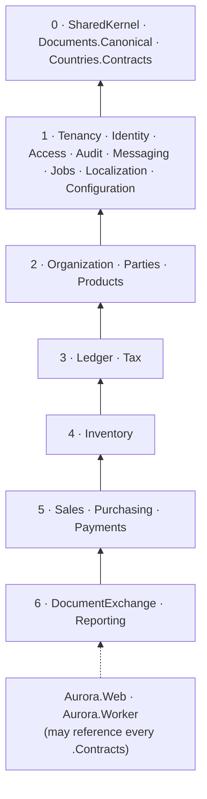

# Module map — bounded contexts, contracts and allowed dependencies

Status: accepted **v2** · Author: architect · Date: 2026-09-11
Companion: `overview.md`, `solution-layout.md`, `../decisions/ADR-0007-multi-tenancy-database-per-tenant.md`, `../decisions/ADR-0008-country-package-contract.md`

**Changes in v2** (2026-09-11, B-03 peer review finding **S-1**): §3 — the SharedKernel row no longer lists `IClock`; time is the BCL `TimeProvider`, consistent with `testing-strategy.md` §3 / rule S3 and ADR-0020.

---

## 1. What a module is here

A module is a **bounded context** with four properties, all of which must be true before the module is considered to exist:

1. **It owns a PostgreSQL schema** in the tenant database, and nothing else writes to it (ADR-0004 rule 1).
2. **It owns a `DbContext`** with its own migrations history inside that schema (ADR-0003 rule 1).
3. **It publishes one contract assembly**, `Aurora.<Module>.Contracts`, and that is the *only* thing another module may reference.
4. **It has a `TenantIsolationContract` test subclass** (ADR-0007 §12.2). A module without one fails the build.

> **Do not create empty modules.** A module folder with no schema, no aggregate and no contract is a pre-commitment to a design nobody has validated. Modules in §7 marked *Planned* have no projects yet, deliberately.

### 1.1 The three ways modules interact — and the two that are forbidden

| Interaction | Allowed? |
|---|---|
| Call another module's **application service** through its `.Contracts` interface, downward per §5 | ✅ |
| React to another module's **integration event**, in-process, after commit (ADR-0015) | ✅ |
| Read another module's **read model** exposed on its `.Contracts` as a query interface | ✅ |
| Query another module's **tables**, directly or through a join | ❌ Never. Different schema, no grant, and a fitness test on `DbContext` model schemas |
| Reference another module's `.Domain`, `.Application` or `.Infrastructure` assembly | ❌ Never. The project reference simply must not exist, asserted by a fitness test |

Aggregates in different modules reference each other **by identifier only** — `CustomerId`, `ItemId`, `AccountId` — never by object reference and never by navigation property. `Aurora.Web` is the one exception: it may reference every module's `.Contracts` because composing screens across contexts is its whole job.

---

## 2. Tiers, and the one rule that makes the graph acyclic

Every module sits in a tier. **A module may hold a compile-time reference only to a strictly lower tier. Modules in the same tier communicate by integration event only.** That single rule makes cycles impossible without anyone having to draw the graph, and it is what the fitness test in `testing-strategy.md` §5 actually checks.

| Tier | Modules | Character |
|---|---|---|
| **0 — Kernel** | `SharedKernel`, `Documents.Canonical`, `Countries.Contracts` | Types, no behaviour that needs a database |
| **1 — Platform** | Tenancy, Identity, Access, Audit, Messaging, Jobs, Localization, Configuration | Technical capabilities, not business contexts |
| **2 — Master data** | Organization, Parties, Products | Upstream of everything business |
| **3 — Financial core** | Ledger, Tax | The store of record and the tax engine |
| **4 — Stock** | Inventory | Needs master data and posts to the financial core |
| **5 — Transactions** | Sales, Purchasing, Payments | The document chains. Peers; events only between them |
| **6 — Edge** | DocumentExchange, Reporting | Consume, never produce, business truth |
| **7 — Planned** | Manufacturing, Projects | No projects yet |

---

## 3. Tier 0 — kernel

| Module | Owns | Public contract | Notes |
|---|---|---|---|
| **SharedKernel** | `Money`, `Quantity`, `Percentage`, `DateRange`, `TenantId`, `CompanyId`, strongly-typed id primitives, `Result`/`Error` | The whole assembly | No EF, no ASP.NET, no `DbContext`. A fitness test asserts it references nothing but the BCL. Deliberately small: every type here is a type nobody can ever change cheaply. **No clock abstraction lives here.** Time is the BCL's `TimeProvider`, injected directly (`testing-strategy.md` §3 and rule S3, ADR-0020) — the kernel neither owns nor wraps it. Do not propose an `IClock`: a wrapper interface would stop `FakeTimeProvider` substituting, which is the only reason `Microsoft.Extensions.TimeProvider.Testing` is an approved dependency |
| **Documents.Canonical** | The jurisdiction-neutral commercial document semantic model (`CommercialInvoice`, `CreditNote`, lines, allowances/charges, tax breakdown, `PayableRoundingAmount`), shaped after EN 16931 | The whole assembly | A deliberate shared kernel between Sales, Purchasing, DocumentExchange and every Country Package. Because packages depend on it, **changes here are core-contract changes** and follow ADR-0008 §3.1 SemVer rules |
| **Countries.Contracts** | The ten extension-point interfaces, `CountryPackageManifest`, `AccountRole` registry | The whole assembly | A Country Package may reference this assembly **and the tier-0 assemblies it is expressed in** — `Aurora.SharedKernel` and `Aurora.Documents.Canonical` — and no other `Aurora.*` assembly (ADR-0031 §2, superseding ADR-0008 §3.1's "only"). Enforced from package metadata before any package code runs, and guarded by an approved-API snapshot test |

---

## 4. Tier 1 — platform modules

These are technical capabilities, not bounded contexts; naming them "modules" keeps the dependency rule uniform.

| Module | Schema | Owns | Public contract | Must not |
|---|---|---|---|---|
| **Tenancy** | `catalog.*` (catalog DB) + `platform.tenant_identity` (tenant DB) | Tenant registry, routing, clusters, provisioning saga, migration runner, `TenantScope`, `ITenantDbContextFactory` | `TenantAccess`/`TenantScope`/`TenantDatabaseHandle`, `ITenantConnectionResolver`, `ITenantAdminConnectionFactory`, `ITenantDbContextFactory<T>`, `ITenantMigrationContextFactory<T>`, `ITenantScopeFactory`, `ITenantSchemaMigrator`, `CoreSchemaVersion`, tenant lifecycle commands (ADR-0027) | Contain a single line of business logic. It is the only module allowed to build a connection string |
| **Identity** | `catalog.identity_user`, `catalog.user_tenant_membership` | Authentication, credentials, MFA state, tenant membership, invitations | `ICurrentUser`, sign-in commands, membership queries | Store authorization. It answers *who*, never *what may they do* |
| **Access** | `access` (tenant DB) | Roles, permissions, role assignments scoped to tenant **and** company, permission catalogue | `IAuthorizationService`, `Permission` constants, role admin commands | Be bypassable. Every application-service command declares a permission (ADR-0010) |
| **Audit** | `audit` (tenant DB) | Append-only audit events, monthly-partitioned, hash-chained; `UPDATE`/`DELETE` revoked at schema granularity and by trigger (ADR-0028) | `IAuditWriter` (takes `TenantAccess` + the caller's `DbContext`, ADR-0028 §4), audit query read model | Accept personal data beyond an actor reference (ADR-0018) |
| **Messaging** | `platform.outbox` (tenant DB), `catalog.outbox` | Transactional outbox, dispatcher, in-process integration-event bus, idempotent consumption | `IIntegrationEvent`, `IIntegrationEventHandler<T>`, `IOutbox` | Dispatch an event whose envelope tenant differs from the handler's scope (ADR-0007 §10.4) |
| **Jobs** | `quartz.*` (catalog DB), `platform.job_run` (tenant DB) | Scheduling, tenant job dispatch, fan-out triggers, job run history | `ITenantJob<T>`, `IPlatformJob`, `ITenantJobScheduler` | Let an `IPlatformJob` reach tenant data directly (ADR-0007 §10.1) |
| **Localization** | `platform.locale_override` (tenant DB) | Resource lookup, culture resolution, formatting policy, locale packs from Country Packages | `IStringLocalizer` wiring, `ICultureResolver`, `IFormatPolicy` | Be optional. There are no hard-coded user-facing strings anywhere |
| **Configuration** | `platform.setting`, `platform.feature_flag_override` (tenant DB) | Tenant and company settings, feature flags with tenant overrides | `ISettings<T>`, `IFeatureFlags` | Hold secrets. Secrets come from the host's secret store only |

---

## 5. Tiers 2–6 — business modules

### Tier 2 — master data

| Module | Schema | Owns (aggregates) | Public contract exposes | Publishes |
|---|---|---|---|---|
| **Organization** | `org` | `Company` (legal entity: name, registered identifiers, base currency, primary jurisdiction, 1..N `TaxRegistration` per ADR-0023), `Site`/warehouse location master, `FiscalYear` and `AccountingPeriod`, `NumberSeries` | `ICompanyQueries`, `IPeriodQueries` (is a date in an open period?), `INumberSeriesAllocator`, `CompanyId` | `CompanyCreated`, `PeriodOpened`, `PeriodClosed`, `TaxRegistrationAdded` |
| **Parties** | `party` | `Party` with **roles** (customer, vendor, or both — a party is frequently both, and modelling two tables guarantees duplicate master data), addresses, contacts, `OrganizationNumber`/`TaxIdentifier` value objects validated through the Country Package validator (ADR-0008 §7 point 7), payment terms, credit limit | `IPartyQueries`, `ICreditPolicy`, `PartyId` | `PartyCreated`, `PartyArchived`, `CreditLimitChanged`, `SubjectErased` |
| **Products** | `product` | `Item` (SKU, type: stocked/service/non-stocked), `UnitOfMeasure` and conversions, item categories, `PriceList`, discount rules | `IItemQueries`, `IPricingService`, `ItemId`, `UomCode` | `ItemCreated`, `ItemDiscontinued`, `PriceListPublished` |

### Tier 3 — financial core

| Module | Schema | Owns (aggregates) | Public contract exposes | Publishes |
|---|---|---|---|---|
| **Ledger** | `ledger` | `Account` and the chart of accounts (seeded by a Country Package, ADR-0008 §7 point 1), `AccountRoleMapping`, `JournalEntry` with immutable `JournalEntryLine`s, `ExchangeRate`, period balances | `IPostingService` (`Post(JournalEntryDraft)` — balanced or rejected), `IAccountResolver.Resolve(AccountRole, CompanyId)`, `ITrialBalanceQueries`, `IFxRateProvider` | `JournalEntryPosted`, `JournalEntryReversed`, `PeriodBalancesRecalculated` |
| **Tax** | `tax` | `TaxCode`, `TaxCategory`, determination rules, `TaxCalculation` results, links to `TaxRegistration` | `ITaxEngine.Determine(context, asOfDate)` and `.Calculate(lines, asOfDate)`, `ITaxCodeQueries` | `TaxRuleSetActivated` |

**Ledger is the store of record and it refuses bad input rather than repairing it.** `IPostingService.Post` rejects an unbalanced entry, an entry into a closed period, an entry whose currency mix is inconsistent, or an entry with no audit actor. Posted lines are immutable; a correction is a reversal (`CLAUDE.md`). No other module may write to `ledger`.

**Tax never computes a rate; it evaluates rules supplied as effective-dated data by a Country Package** (ADR-0008 §6.2). Every entry point takes an explicit `asOfDate` — there is no overload that reads the clock.

### Tier 4 — stock

| Module | Schema | Owns (aggregates) | Public contract exposes | Publishes |
|---|---|---|---|---|
| **Inventory** | `inventory` | `StockItem` balance per (item, warehouse, lot/serial), `StockMovement` (receipt, shipment, transfer, adjustment, count), `ValuationLayer` (FIFO layers / moving average / standard cost, **per item**, not per tenant), `Reservation`, `CycleCount` | `IStockQueries` (available-to-promise), `IReservationService`, `IStockMovementService`, `IValuationQueries` | `StockReceived`, `StockShipped`, `StockAdjusted`, `StockValuationChanged`, `NegativeStockDetected` |

Inventory is a **ledger parallel to the accounting ledger**: every movement changes a quantity *and* has a cost effect. The cost effect posts to `ledger` through `IPostingService` (a downward call, tier 4 → tier 3), using `AccountRole.InventoryAsset` and `AccountRole.CostOfGoodsSold`. Inventory never names an account.

### Tier 5 — transactions (peers; events only between them)

| Module | Schema | Owns (aggregates) | Public contract exposes | Publishes |
|---|---|---|---|---|
| **Sales** | `sales` | `Quote`, `SalesOrder` (ordered/delivered/invoiced quantity tracked **independently per line**), `Delivery`, `SalesInvoice`, `CreditNote` | `ISalesOrderQueries`, `ISalesInvoiceQueries`, command interfaces, `SalesInvoiceId` | `SalesOrderConfirmed`, `DeliveryDispatched`, `SalesInvoicePosted`, `CreditNotePosted` |
| **Purchasing** | `purchasing` | `PurchaseOrder`, `GoodsReceipt`, `VendorInvoice`, three-way match, `DebitNote`, landed cost allocation | `IPurchaseOrderQueries`, `IVendorInvoiceQueries` | `PurchaseOrderIssued`, `GoodsReceived`, `VendorInvoicePosted`, `LandedCostAllocated` |
| **Payments** | `payments` | `OpenItem` (generic: source module, source document id, party, amount, due date), incoming/outgoing `Payment`, `CashApplication`, `BankAccount`, imported `BankStatement` and reconciliation | `IOpenItemQueries` (aged balances), `IPaymentService`, `IBankFormatGateway` | `PaymentReceived`, `PaymentMade`, `OpenItemSettled`, `StatementImported` |

**Delivery and Invoice are separate aggregates** and this is not negotiable. A wholesale business routinely delivers in partial shipments against one order and invoices on a different rhythm — consolidated, per shipment, or on a schedule. Fusing "shipped" and "invoiced" into one step is exactly the gap that pushes trading businesses off accounting-only tools (`../research/processes/order-to-cash.md`). Ordered, delivered and invoiced quantities are tracked independently per line; an order line stays open until both are satisfied, in either order.

**A credit note is its own document referencing the original invoice**, never a negative invoice edited in place, and it can credit part of a single line.

**Payments deliberately does not reference Sales or Purchasing.** It owns a generic `OpenItem` created by reacting to `SalesInvoicePosted` and `VendorInvoicePosted`. Composing "which invoice is behind this open item?" for a screen is `Aurora.Web`'s job. This keeps AR and AP symmetric and keeps the bank-format extension points (ADR-0008 §7 point 5) in one place.

### Tier 6 — edge

| Module | Schema | Owns | Public contract exposes | Notes |
|---|---|---|---|---|
| **DocumentExchange** | `docex` | Outbound/inbound e-document transmissions, transport receipts, an archive of exact transmitted payloads | `IDocumentTransmissionQueries`, `ISendEDocument` | Maps `Documents.Canonical` → the country profile via the Country Package's `IEInvoicingProfile` (ADR-0008 §7 point 4). **UBL, Peppol and XML appear nowhere else in the solution** |
| **Reporting** | `reporting` | Read models built from integration events, financial statement definitions, statutory report runs and their outputs | `IReportRunner`, `IReadModelQueries` | Reads business truth through **other modules' contracts and events**, never their tables. Statutory report boxes map to account roles and tax categories (ADR-0008 §7 point 3), so a core schema change cannot break a country's return |

### Tier 7 — planned, no projects yet

**Manufacturing** (`manufacturing`: BOM, routing, work order, MRP) and **Projects** (`projects`: project, task, time entry, WIP). Both depend on Products and Inventory when they arrive. They are named here so nobody invents a different name later, and they have no code.

---

## 6. Allowed dependency matrix

Compile-time project references onto the **provider's `.Contracts` assembly**. `E` = **events only, no reference**. Empty = forbidden.

| Consumer ↓ / Provider → | Kernel | Platform | Org | Party | Prod | Ledger | Tax | Inv | Sales | Purch | Pay | DocEx | Rep |
|---|---|---|---|---|---|---|---|---|---|---|---|---|---|
| **Platform** | ✅ | ✅ | | | | | | | | | | | |
| **Organization** | ✅ | ✅ | — | | | | | | | | | | |
| **Parties** | ✅ | ✅ | ✅ | — | | | | | | | | | |
| **Products** | ✅ | ✅ | ✅ | E | — | | | | | | | | |
| **Ledger** | ✅ | ✅ | ✅ | E | | — | | | | | | | |
| **Tax** | ✅ | ✅ | ✅ | ✅ | ✅ | E | — | | | | | | |
| **Inventory** | ✅ | ✅ | ✅ | ✅ | ✅ | ✅ | ✅ | — | | | | | |
| **Sales** | ✅ | ✅ | ✅ | ✅ | ✅ | ✅ | ✅ | ✅ | — | E | E | | |
| **Purchasing** | ✅ | ✅ | ✅ | ✅ | ✅ | ✅ | ✅ | ✅ | E | — | E | | |
| **Payments** | ✅ | ✅ | ✅ | ✅ | | ✅ | | | E | E | — | | |
| **DocumentExchange** | ✅ | ✅ | ✅ | ✅ | | | | | E | E | E | — | |
| **Reporting** | ✅ | ✅ | ✅ | ✅ | ✅ | ✅ | ✅ | ✅ | E | E | E | E | — |
| **Country Packages** | Countries.Contracts + Documents.Canonical only | | | | | | | | | | | | |
| **Aurora.Web / Aurora.Worker** | every module's `.Contracts`, and no module's `.Domain` or `.Infrastructure` | | | | | | | | | | | | |

Notes on three entries that will be questioned:

- **Ledger → Parties is events only.** The ledger stores an account and an optional party *identifier* on a line; it must not depend on party master data to post. It subscribes to `SubjectErased` for pseudonymisation (ADR-0018).
- **Payments does not reference Products or Sales.** See §5, tier 5.
- **Reporting references everything downward.** It is the one legitimate wide consumer, and it is at the top of the graph precisely so that nothing depends on *it*.

---

## 7. Build order

From `../research/01-feature-priority.md`, whose scoring corrects the naive sequence: **inventory belongs alongside order-to-cash and the accounting core, not after procure-to-pay.** You cannot run a believable order-to-cash flow for a trading business without stock underneath it — "ship goods" and "recognise cost of goods sold" are the same event.

| # | Slice | Modules | Why here |
|---|---|---|---|
| 1 | **Walking skeleton** | Tenancy, Identity, Access, Audit, Messaging, Jobs, Configuration, Localization, Countries hosting | Proves tenancy and the package seam before any business code exists. Both are rewrites if retrofitted |
| 2 | **Master data** | Organization, Parties, Products | Everything reads these. First exercise of the identifier-validator extension point |
| 3 | **Accounting core** | Ledger, Tax + the **first Country Package (New Zealand)** | Promoted ahead of inventory and sales because both must post and must apply tax from day one to be more than a toy, and because this is where the chart-of-accounts and tax-rule extension points first get exercised end to end |
| 4 | **Inventory** | Inventory | Minimal slice first: on-hand quantity, one valuation method, a single default warehouse |
| 5 | **Order to cash** | Sales, then Payments (AR side) | Widen inventory and sales together — multi-warehouse and further valuation methods — rather than finishing sales and bolting stock on |
| 6 | **Procure to pay** | Purchasing, Payments (AP side) | Trails by one slice; nothing downstream needs it first |
| 7 | **Statutory reporting and close** | Reporting | Proves the statutory-report extension point end to end |
| 8 | **E-invoicing** | DocumentExchange + the NZ package's `IEInvoicingProfile` | Can be pulled forward opportunistically once `SalesInvoice` exists — high differentiation, and it is the strongest proof that the package contract is real |
| 9 | **Manufacturing, Projects** | — | Highest effort, narrowest audience |

**Multi-currency is not a slice; it is a property.** `Money` is `(decimal amount, Currency)` from the first commit, and every document records the FX rate and its source and date. Retrofitting multi-currency into a ledger is a rewrite (ADR-0021).

---

## 8. Extracting a module into a service later

The architecture is a modular monolith (ADR-0006). Extraction must stay possible without being planned for, so:

- A module's **only** inbound surface is its `.Contracts` assembly. Extraction replaces the in-process implementation with an HTTP or queue client behind the same interfaces. Callers do not change.
- Integration events already cross an at-least-once boundary with idempotent consumers (ADR-0015), so the semantics do not change when the boundary becomes a network.
- A module never joins across schemas, so its data moves with it.
- The two candidates, if scaling ever demands it: **Reporting** (read-heavy, bursty, tolerates eventual consistency) and **DocumentExchange** (slow external I/O, retry-heavy, entirely event-driven). Neither is planned.
- **Ledger is not a candidate.** Posting must be transactional with the document that causes it wherever that is achievable; making it remote would trade correctness for scale, which inverts the quality ranking in `overview.md` §4.
