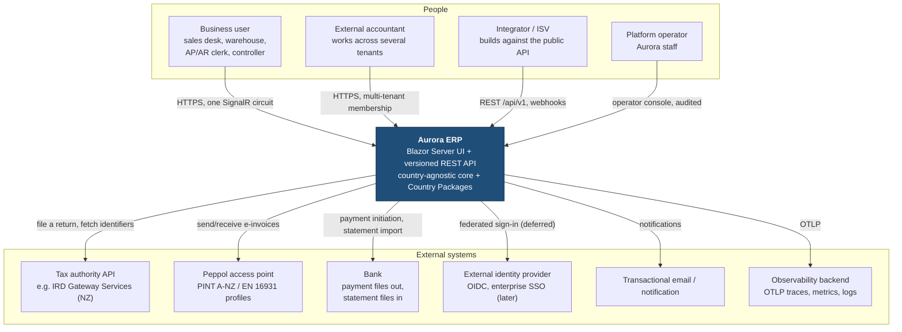
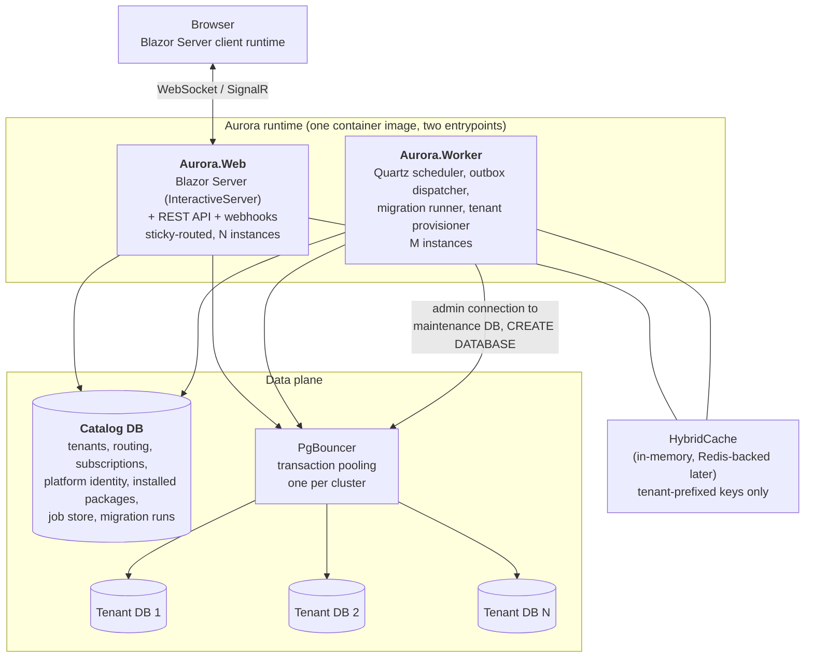

# Architecture Overview — Aurora ERP

Status: accepted v1 · Author: architect · Date: 2026-09-10
Companion documents: `modules.md`, `scalability.md`, `testing-strategy.md`, `dependencies.md`, `solution-layout.md`, and `../decisions/`.

## 1. What this system is

Aurora ERP is a multi-tenant SaaS ERP for businesses of roughly 10–250 employees, initially trading/wholesale and light manufacturing. Its distinguishing architectural bet is a **country-agnostic core plus installable Country Packages**: every jurisdiction rule — chart of accounts, tax rates, statutory reports, e-invoicing, bank formats, identifier checksums, locale, retention — arrives as a versioned, installable unit. The core contains no jurisdiction branches. See `../decisions/ADR-0008-country-package-contract.md`.

Each tenant gets its own PostgreSQL database. One shared *catalog* database holds the tenant registry, routing, subscriptions, platform identity and installed-package records — and no tenant business data. See `../decisions/ADR-0007-multi-tenancy-database-per-tenant.md`.

## 2. System context

Every arrow into an external system is reached through a **Country Package extension point or a core port**, never from module code directly. Tax authorities, Peppol profiles and bank formats differ per jurisdiction; that difference is package data, not core branching.

## 3. Container view

`Aurora.Web` and `Aurora.Worker` are built from the same image so application code and schema expectations can never drift between them.

## 4. Quality attributes, ranked

The ranking is the tie-breaker whenever two attributes conflict. It is deliberate and it is ordered; a reviewer may cite it to reject a change.

| # | Attribute | What it means here | How we know we have it |
|---|---|---|---|
| 1 | **Financial correctness** | Money is `decimal` + currency. Posted ledger entries are immutable; corrections are reversals. Balanced entries only. No silent rounding. | Domain unit tests per invariant; ledger property tests; an architecture test forbidding `double`/`float` in any domain project; explicit rounding-residual account (ADR-0021). |
| 2 | **Tenant isolation** | A request, job or event in tenant A can never read or write tenant B. Enforced structurally, not by convention. | Compile-time: no `DbContext` without a `TenantScope`. Runtime: connected-database identity check. Tests: the mandatory isolation pattern per module (ADR-0007, `testing-strategy.md`). |
| 3 | **Security** | OWASP ASVS L2. Authorization on every command and endpoint, validation at the boundary, parameterized queries, least-privilege database roles, no secrets in the repo. | An architecture test that every command declares a permission; role-privilege assertions in integration tests; dependency licence + vulnerability gate in `verify.sh`. |
| 4 | **Changeability** | This system must be maintainable for a decade by people who never met us. Module boundaries, dependency direction and the Country Package contract are the mechanism. | ArchUnitNET fitness tests for layer and module rules; ADRs; module contract assemblies. |
| 5 | **Auditability & compliance** | Who changed what, when, in which tenant and company. Statutory retention honoured. GDPR erasure without destroying statutory records. | Append-only audit tables with revoked UPDATE/DELETE; retention declared by Country Package; erasure = pseudonymisation of personal identifiers (ADR-0007 §11, ADR-0018). |
| 6 | **Availability** | An ERP outage stops a business shipping goods. Target 99.9% for the web tier; a single tenant's failure must not take down others. | Per-tenant failure containment (a blocked tenant is served a maintenance page, others keep running); health probes that never fan out across all tenant databases. |
| 7 | **Performance & scalability** | Interactive actions p95 < 500 ms; reports over 10 000 rows run as jobs. Scale by adding instances and database clusters. | Load assumptions and stage triggers in `scalability.md`; no unbounded query (fitness test on `IQueryable` materialization without a limit). |
| 8 | **Cost efficiency** | Database-per-tenant is the expensive isolation choice. Keep the per-tenant idle cost near zero. | Pool sizing (`Min Pool Size=0`, short idle lifetime), bounded data-source cache, tenant density targets per cluster. |
| 9 | **Time to market** | Last, deliberately. We will spend a bootstrap iteration on the tenancy and package seams because retrofitting either is a rewrite. | The walking skeleton proves tenancy and packages before any business module ships. |

**Explicit trade-offs.** Isolation beats cost (that is what database-per-tenant buys). Correctness beats performance (we will run a slower balanced posting rather than a fast unbalanced one). Changeability beats time to market (the Country Package contract exists before the first country package). Availability beats consistency only outside the ledger: integration events are at-least-once and eventually consistent, but a posting is transactional and never eventually anything.

## 5. Constraints

### 5.1 Locked by the product owner (not open to agents)
| Constraint | ADR |
|---|---|
| .NET 10 (LTS), C# | ADR-0002 |
| Entity Framework Core | ADR-0003 |
| PostgreSQL | ADR-0004 |
| Blazor Server, `InteractiveServer` render mode | ADR-0005 |
| Database per tenant + one shared catalog database holding no tenant business data | ADR-0007 |
| Country-agnostic core; jurisdiction logic in installable Country Packages | ADR-0008 |

Where the architect disagrees with a locked choice, the disagreement and its mitigation are written in that ADR's Consequences section. Nothing is silently designed around.

### 5.2 Verified environment (do not re-verify)
.NET SDK 10.0.401 at `/usr/share/dotnet` · ASP.NET Core runtime 10.0.12 · `Npgsql.EntityFrameworkCore.PostgreSQL` 10.0.3 · `Testcontainers.PostgreSql` 4.15.0 · image `postgres:17-alpine` · xunit 2.9.3. Run `source scripts/dev-env.sh` before any `dotnet` command.

Three facts the spike surfaced, which the design obeys:
1. `CREATE DATABASE` needs a connection to a *different* database on the same server → tenant provisioning uses an **admin connection distinct from every tenant connection**, and provisioning is a resumable saga, not a transaction (`CREATE DATABASE` cannot run inside a transaction block).
2. Container startup is ~9 s → integration tests **share one PostgreSQL container per xUnit collection**.
3. `PostgreSqlBuilder`'s parameterless constructor is obsolete in Testcontainers 4.15.0 → the image is pinned explicitly in the fixture.

### 5.3 Organisational and legal constraints
- Third-party dependencies must be MIT, Apache-2.0 or BSD, recorded in `dependencies.md` with a verified licence. Several popular .NET libraries moved to commercial licences during 2025–2026; see the rejected-on-licensing table in that document.
- No deployments, no cloud resources, no spending, no service sign-ups, no real customer or personal data. `docker compose` locally is the entire runtime story for this team.
- .NET 10 support ends **2028-11-10**. A framework upgrade is a scheduled programme, not an emergency.

## 6. Assumptions

Each assumption names what would falsify it, because an assumption nobody can disprove is a decision in disguise.

| # | Assumption | Falsified by | If falsified |
|---|---|---|---|
| A1 | Tenants are ≤ 5 000 per PostgreSQL cluster and ≤ 25 000 in total for the life of this design. | Sales pipeline exceeding 2 000 paying tenants. | Re-open ADR-0007; introduce a shared-schema tier for the long tail (the `ITenantConnectionResolver` seam exists for this). |
| A2 | A tenant is one *group* of legal entities, each with one primary jurisdiction. | A single prospect legally registered for indirect tax in several jurisdictions on one entity (EU OSS-style). | ADR-0023's seam (`ITaxRegistration` is 1..N on Company from day one) is activated; the behaviour, not the schema, is the work. |
| A3 | Interactive users are a minority of employees (~30%) and peak concurrency is ~40% of named users. | Telemetry from the first ten tenants. | Re-run the circuit arithmetic in `scalability.md`; consider `InteractiveAuto` for the heaviest screens (ADR-0005 keeps that door open). |
| A4 | Documents/day per tenant is in the hundreds, not the hundred-thousands. | A high-volume e-commerce tenant. | Not a fit for this tier; either shard that tenant onto its own cluster (already possible) or decline. |
| A5 | Country Packages can be authored by us, and later by partners, without dynamic code download at bootstrap. | A partner demanding to ship a package we do not build. | Activate the `AssemblyLoadContext` + signature-verification seam named in ADR-0008 §9. |
| A6 | New Zealand's IRD Gateway Services registration has no in-country-presence requirement. | Attempting the sandbox registration and being refused. | Switch the first reference package to Australia (the researcher's second choice); the contract is unchanged. |
| A7 | A managed or self-run PostgreSQL with a superuser-capable admin role is always available. | A hosting target that forbids `CREATE DATABASE`. | Database-per-tenant is impossible there; that hosting target is out of scope. |

## 7. Where to read next

| Question | Document |
|---|---|
| What are the bounded contexts and who may depend on whom? | `modules.md` |
| How is a tenant resolved and how is isolation guaranteed? | `../decisions/ADR-0007-multi-tenancy-database-per-tenant.md` |
| What exactly is a Country Package allowed to do? | `../decisions/ADR-0008-country-package-contract.md` |
| What breaks first as we grow, and what do we do about it? | `scalability.md` |
| What must a developer test, and what does `verify.sh` run? | `testing-strategy.md` |
| Which projects exist and what may reference what? | `solution-layout.md` |
| Which third-party packages are allowed, and why? | `dependencies.md` |
